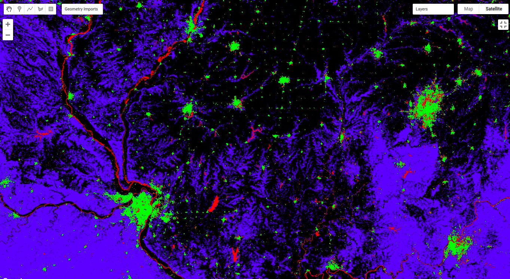

# Landcover Classification

<b>Dataset:</b> 
<ul>
	<li>NLCD USGS National Land Cover Database</li>
	<li>USGS Landsat 8 Collection 1 Tier 1 and Real-Time data TOA Reflectance</li>
</ul>

<b>CNN Model used</b> Unet

<b>Landcover Types/Classes</b>
<ul>
	<li><b>water</b>Open Water, Ice, Snow etc.</li>
	<li><b>Dev</b>Developed Areas, Sand, Open areas, Clay etc.</li>
	<li><b>Vegi</b>High Vegitation, Forest, Grass land, Crops etc.</li>
	<li><b>Wetland</b>Wetlands, Woody wetlands</li>

</ul>

